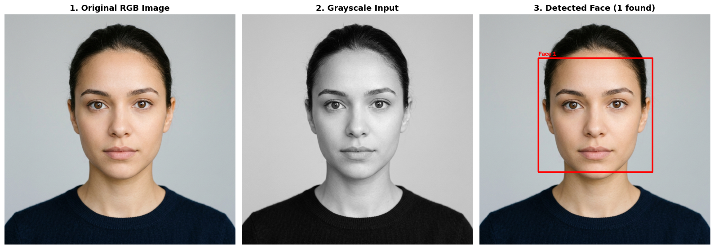
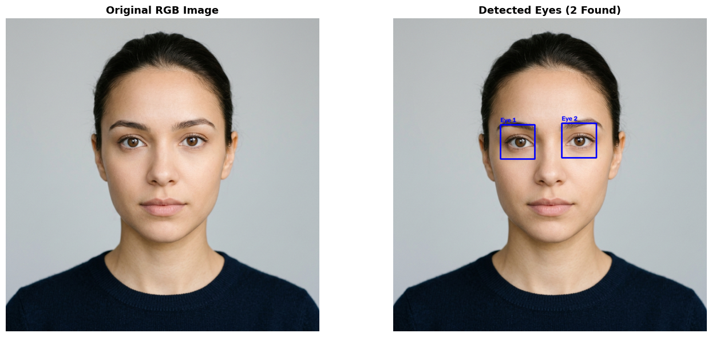
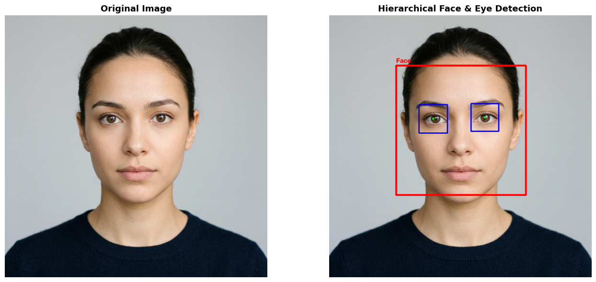
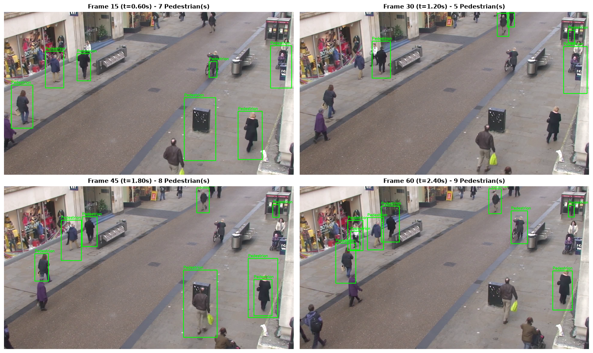
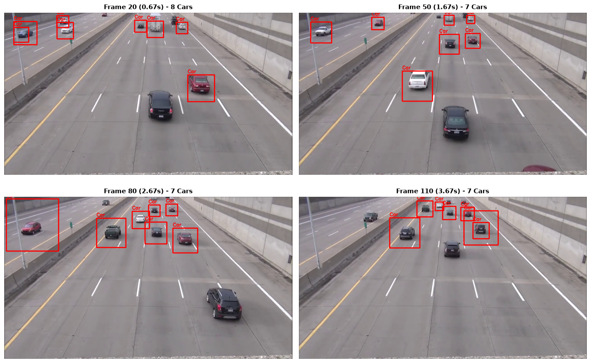
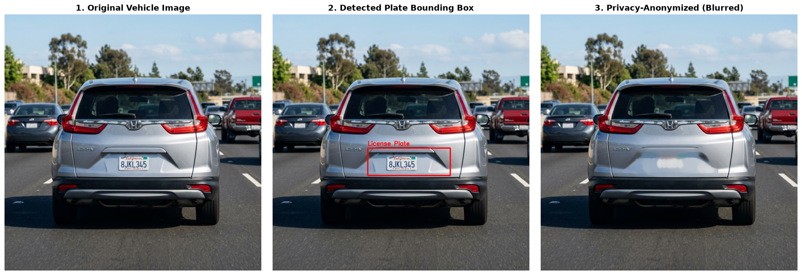

# Computer Vision: Object Detection with OpenCV & Python

<div align="center">
  
</div>

<br>

<div align="center">

[](https://www.python.org/)
[](https://opencv.org/)
[](https://numpy.org/)
[](https://matplotlib.org/)


[](https://github.com/astral-sh/uv)
[](https://en.wikipedia.org/wiki/Viola%E2%80%93Jones_object_detection_framework)
[](LICENSE)

</div>


A comprehensive hands-on computer vision project implementing real-time object detection using **Haar Feature-based Cascade Classifiers** (Viola-Jones framework) with **OpenCV** and **Python**. This repository covers static image detection (single and multi-face localization, eye isolation, vehicle license plate detection, and privacy anonymization) and dynamic video stream processing (walking pedestrian tracking, highway traffic analytics).

---

## Table of Contents

- [Overview](#overview)
- [How Haar Cascade Classifiers Work](#how-haar-cascade-classifiers-work)
- [Project Modules](#project-modules)
  - [1. Face Detection](#1-face-detection)
  - [2. Eye Detection](#2-eye-detection)
  - [3. Hierarchical Face & Eye Detection](#3-hierarchical-face--eye-detection)
  - [4. Pedestrian Detection in Video](#4-pedestrian-detection-in-video)
  - [5. Vehicle Detection in Video](#5-vehicle-detection-in-video)
  - [6. License Plate Detection & Privacy Blurring](#6-license-plate-detection--privacy-blurring)
- [Detection Results Gallery](#detection-results-gallery)
- [Getting Started](#getting-started)
  - [Prerequisites](#prerequisites)
  - [Installation](#installation)
  - [Running the Notebooks](#running-the-notebooks)
- [Key Hyperparameters](#key-hyperparameters)
- [Quick Code Example](#quick-code-example)
- [License](#license)
- [Connect with Me](#-connect-with-me)

---

## Overview

Object detection is a cornerstone discipline in Computer Vision. While modern deep learning architectures (YOLO, SSD, Faster R-CNN) dominate complex multi-class detection, classical **Haar Cascade Classifiers** (proposed by Paul Viola and Michael Jones in 2001) remain widely favored for edge computing, low-resource embedded hardware, and ultra-fast real-time applications.

Each notebook in this repository has been structured with:
- **Consistent Design & Visual Hierarchy**: Styled dark gradient header banners and color-coded section badges.
- **Interactive Navigation**: Dedicated Table of Contents with jump links to every section and visualization.
- **Analytical Studies**: In-depth hyperparameter tuning (`minNeighbors`, `scaleFactor`), multi-object sorting, and traffic/pedestrian flow analytics.

---

## How Haar Cascade Classifiers Work

The Viola-Jones detection framework operates through four fundamental innovations:

1. **Haar Features**: Rectangular kernel windows that capture contrasts in pixel intensity (edge features, line features, and center-surround features).
2. **Integral Images**: An intermediate representation that computes the sum of pixel values in any arbitrary bounding rectangle in constant time $O(1)$.
3. **AdaBoost Training**: An adaptive boosting algorithm that selects a small number of critical features from hundreds of thousands of candidate features.
4. **Cascading Architecture**: Classifiers are grouped into stages of increasing complexity. Regions of interest that fail an early stage are immediately rejected, saving computing power for potential target regions.

---

## Project Modules

| # | Notebook | Target | Cascade Model | Media Type | Key Features |
|:---:|---|---|---|:---:|---|
| **01** | [`01_Face_Detection.ipynb`](01_Face_Detection.ipynb) | Human Faces | `haarcascade_frontalface_default.xml` | Image | Single-face pipeline, multi-face group detection, `minNeighbors` parameter study |
| **02** | [`02_Eyes_Detection.ipynb`](02_Eyes_Detection.ipynb) | Human Eyes | `haarcascade_eye.xml` | Image / ROI | Dual-eye localization, cropped eye ROI isolation, size constraints |
| **03** | [`03_Face_and_Eyes_Detection.ipynb`](03_Face_and_Eyes_Detection.ipynb) | Faces + Eyes | `haarcascade_frontalface_default.xml` + `haarcascade_eye.xml` | Hierarchical ROI | Upper-face ($58\%$) search space constraint, eliminating false positives |
| **04** | [`04_Pedestrians_Detection.ipynb`](04_Pedestrians_Detection.ipynb) | Walking Pedestrians | `haarcascade_fullbody.xml` | Video Stream | Video metadata inspection, 4-frame gallery, pedestrian flow analytics, video loop |
| **05** | [`05_Car_Detection.ipynb`](05_Car_Detection.ipynb) | Moving Vehicles | `haarcascade_car.xml` | Video Stream | Traffic video analytics, multi-car detection gallery, flow density trend |
| **06** | [`06_Car_Plates_Detection.ipynb`](06_Car_Plates_Detection.ipynb) | License Plates & Anonymization | `haarcascade_plate_number.xml` | Image | Plate ROI extraction, `cv2.medianBlur()` privacy blurring, pixel intensity histogram |

---

### 1. Face Detection
- **Notebook**: [`01_Face_Detection.ipynb`](01_Face_Detection.ipynb)
- **Classifier**: `Haarcascades/haarcascade_frontalface_default.xml`
- **Key Workflow**:
  1. Load image via `cv2.imread()`.
  2. Convert BGR color space to Grayscale using `cv2.cvtColor()`.
  3. Detect multi-scale facial bounding boxes via `detectMultiScale(gray, scaleFactor=1.3, minNeighbors=5, minSize=(30, 30))`.
  4. Non-destructive overlay of bounding rectangles via `cv2.rectangle()`.
  5. Multi-face group detection with X-coordinate sorting and isolated face gallery extraction.
  6. Empirical study on the effect of `minNeighbors` on precision vs. recall.

### 2. Eye Detection
- **Notebook**: [`02_Eyes_Detection.ipynb`](02_Eyes_Detection.ipynb)
- **Classifier**: `Haarcascades/haarcascade_eye.xml`
- **Key Workflow**:
  1. Detect ocular features across the image.
  2. Configure `minSize=(60, 60)` to discard small contrast artifacts (nostrils, skin folds).
  3. Crop and isolate detected eye regions of interest (ROI) for close-up side-by-side inspection.

### 3. Hierarchical Face & Eye Detection
- **Notebook**: [`03_Face_and_Eyes_Detection.ipynb`](03_Face_and_Eyes_Detection.ipynb)
- **Classifiers**: `haarcascade_frontalface_default.xml` + `haarcascade_eye.xml`
- **Key Workflow**:
  1. Detect the coarse object (face) bounding box $(x, y, w, h)$ first.
  2. Constrain eye detection strictly inside the upper portion of the face ROI (`upper_h = int(h * 0.58)`).
  3. Eliminates false-positive detections on lips, neck, and clothing while reducing computation.

### 4. Pedestrian Detection in Video
- **Notebook**: [`04_Pedestrians_Detection.ipynb`](04_Pedestrians_Detection.ipynb)
- **Classifier**: `Haarcascades/haarcascade_fullbody.xml`
- **Key Workflow**:
  1. Open video stream using `cv2.VideoCapture('assets/video/Town_Centre_Surveillance.mp4')`.
  2. Extract stream properties (resolution, FPS, duration, frame count).
  3. Sample representative frames across time and render a 4-frame detection gallery.
  4. Track pedestrian density over time for flow analytics.
  5. Standalone video playback loop with clean keyboard controls (`q` / `ESC`).

### 5. Vehicle Detection in Video
- **Notebook**: [`05_Car_Detection.ipynb`](05_Car_Detection.ipynb)
- **Classifier**: `Haarcascades/haarcascade_car.xml`
- **Key Workflow**:
  1. Process traffic surveillance video (`assets/video/Vehicles.mp4`).
  2. Detect passing vehicles across varying illumination and scale conditions.
  3. Sample traffic frames and compute vehicle flow density over time.
  4. Real-time video playback loop with bounding box tracking.

### 6. License Plate Detection & Privacy Blurring
- **Notebook**: [`06_Car_Plates_Detection.ipynb`](06_Car_Plates_Detection.ipynb)
- **Classifier**: `Haarcascades/haarcascade_plate_number.xml`
- **Key Workflow**:
  1. Detect vehicle license plates using the plate cascade classifier.
  2. Extract plate coordinates $(x, y, w, h)$.
  3. Apply `cv2.medianBlur(plate_roi, 25)` to thoroughly anonymize alphanumeric characters without edge bleeding.
  4. Analyze pixel intensity distributions (histograms) before and after blurring to demonstrate privacy compliance.

---

## Detection Results Gallery

| Module | Task | Output Preview |
|:---:|:---|:---|
| **01** | **Face Detection Pipeline** |  |
| **02** | **Eye Detection & Extraction** |  |
| **03** | **Hierarchical Face & Eyes** |  |
| **04** | **Pedestrian Video Gallery** |  |
| **05** | **Vehicle Traffic Gallery** |  |
| **06** | **License Plate Anonymization** |  |

---


## Getting Started

### Prerequisites
- Python 3.10 to 3.13
- `pip` or [`uv`](https://github.com/astral-sh/uv) package manager
- Webcam (optional, for live video testing)

### Installation

#### Option A: Using `uv` (Recommended - Ultra Fast)
```bash
# Clone the repository
git clone https://github.com/mohd-faizy/13P_Object-Detection-with-OpenCV---Python.git
cd 13P_Object-Detection-with-OpenCV---Python

# Create and activate environment, and install dependencies
uv venv
source .venv/bin/activate   # On Windows: .venv\Scripts\activate
uv pip install -r requirements.txt
```

#### Option B: Using standard `pip`
```bash
# Clone the repository
git clone https://github.com/mohd-faizy/13P_Object-Detection-with-OpenCV---Python.git
cd 13P_Object-Detection-with-OpenCV---Python

# Create and activate virtual environment
python -m venv .venv
source .venv/bin/activate   # On Windows: .venv\Scripts\activate

# Install dependencies
pip install -r requirements.txt
```

### Running the Notebooks

Launch the Jupyter interface:
```bash
jupyter notebook
```
Or open in VS Code / Cursor with the Jupyter extension installed, select the `.venv` kernel, and execute cells interactively.

---

## Key Hyperparameters

When invoking `detectMultiScale()`, three primary hyperparameters dictate accuracy, recall, and processing speed:

$$\text{detectMultiScale}(\text{image}, \text{scaleFactor}, \text{minNeighbors}, \text{minSize})$$

- **`scaleFactor`** (e.g., `1.1` to `1.3`):
  Specifies the scale reduction step factor of the image pyramid. Smaller values (e.g., `1.05`) increase detection accuracy for subtle features at the cost of higher computation time.
- **`minNeighbors`** (e.g., `3` to `6`):
  Specifies the minimum number of neighboring candidate rectangles required to retain a detection. Higher values eliminate false positives but risk false negatives; lower values increase recall.
- **`minSize`** (e.g., `(30, 30)` or `(60, 60)`):
  Specifies the minimum bounding box dimension. Regions smaller than this threshold are discarded immediately, filtering out high-frequency background noise.

---

## Quick Code Example

```python
import cv2
import matplotlib.pyplot as plt

# 1. Load the pre-trained Haar Cascade classifier
face_cascade = cv2.CascadeClassifier('Haarcascades/haarcascade_frontalface_default.xml')

# 2. Read and convert color space to Grayscale
img = cv2.imread('assets/images/eye_face.jpg')
gray = cv2.cvtColor(img, cv2.COLOR_BGR2GRAY)

# 3. Detect faces using multi-scale pyramid
faces = face_cascade.detectMultiScale(gray, scaleFactor=1.3, minNeighbors=5, minSize=(30, 30))

# 4. Draw non-destructive bounding boxes
img_annotated = img.copy()
for (x, y, w, h) in faces:
    cv2.rectangle(img_annotated, (x, y), (x + w, y + h), (0, 255, 0), 3)

# 5. Display the result
img_rgb = cv2.cvtColor(img_annotated, cv2.COLOR_BGR2RGB)
plt.figure(figsize=(8, 6))
plt.imshow(img_rgb)
plt.title(f'Detected Faces: {len(faces)}', fontsize=14, fontweight='bold')
plt.axis('off')
plt.show()
```

---

## 🔗 Connect with Me

<div align="center">

[](https://github.com/mohd-faizy)
[](https://www.linkedin.com/in/mohd-faizy/)
[](https://twitter.com/F4izy)
[](https://ai.stackexchange.com/users/36737/faizy)

</div>

